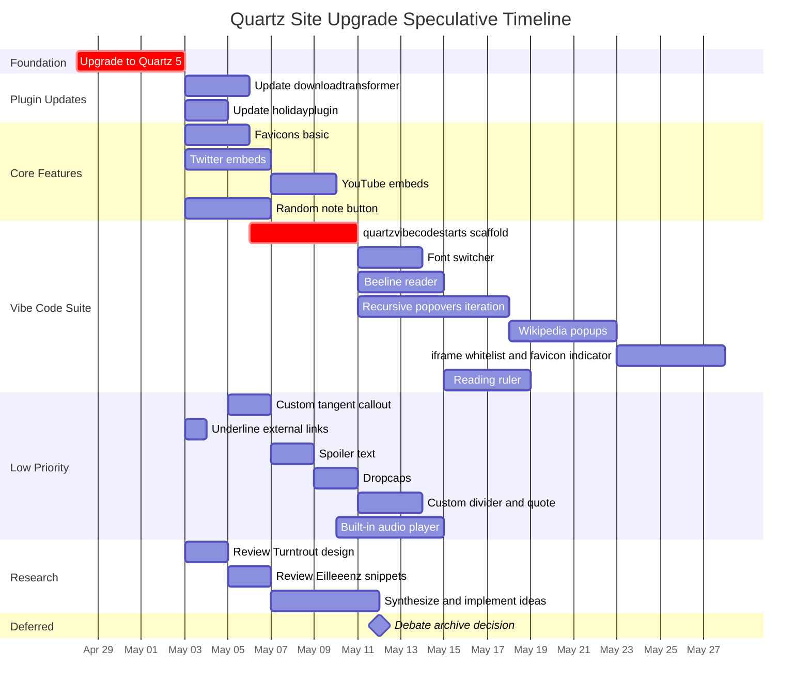

This is the list of ongoing or yet to be completed tasks on the website. I'm a little worried it's going to get longer before it gets shorter.
# In progress
## High Priority
- [x] Upgrade to quartz 5 - prereq for all following
	- [x] Update [[downloadtransformer]]
	- [x] Update [[holidayplugin]]
	- [ ] Implement [[quartzvibecodestarts]]
		- This probably turns into an accessibility suite, I'd like to have a font switcher, beeline, and maybe a quartz version of the [reading ruler](readingruler) eventually
		- Recursive popovers need more vibe-coded iteration, and it would be nice to at least get working wikipedia popups too -- full scale popups of archived other sites like [gwern.net](gwern.net) is probably overkill, but if there's a way to make some more iframes work, that would be cool -- could use a whitelist for sites and maybe include some kind of visual indicator on the favicon
	- [x] Accessibility suite -- see above
	- [x] Implement tags at the top of page -- [[sitedesign#Parent and Child Tag Links]]
	- [x] Add random note button
		- I wonder if I could fit it in with the reader mode and the night mode toggle switch and just shrink the search bar a bit
		- The icon should be the face of a six sided die, and pressing it should roll the die along with going to a random note
	- [x] Fix random note button
		- [x] It should only go to content pages, no tag or folder pages
		- [x] Stop flashing screen
		- [x] Render rolled die after new page is loaded
		- [x] Don't visually roll die twice
	- [ ] Favicons
	- [ ] Twitter embeds
	- [x] Youtube embeds
		- Thanks Quartz 5!
- [ ] Customize color scheme
# Quartz 5 panic mode
- [x] Fix colors
- [x] Update footer
- [ ] Figure out why the syncer doesn't recognize the repo as being for quartz 5 (it really thinks it's on quartz 4)
## in plugin
npm run build 
git add -A 
git commit -m "fix alias" 
git push
## in quartz
npx quartz plugin remove quartz-random-note
npx quartz plugin add github:UndefeatedOrca/quartz-random-note
## Low Priority
- [ ] Configure a custom callout for tangents using [this info](https://quartz.jzhao.xyz/features/callouts)
- [ ] Built in audio player
- [ ] Go steal a bunch of other people's site design ideas
	- [ ] [Turntrout](https://turntrout.com/design)
		- [ ] Spoiler text
		- [ ] favicons
		- [ ] dropcaps
	- [ ] [Eilleeenz](https://quartz.eilleeenz.com/Quartz-Snippets)
		- [ ] twitter embeds
		- [ ] also has spoilers - this feels like it should maybe be stock behavior
		- [ ] also has favicons, several option
		- [ ] random page
		- [ ] underline external links
		- [ ] custom callout formatting and blocks
	- In some instances, it might make more sense to vibecode the features
- [ ] Custom aesthetic divider (with randomized quote right after page content?)
- [x] Consider moving the [debate archive](policy/Debate/DebateArchive/index) to a separate site
	- nah, they can deal
- [ ] Customize bullet points
- [ ] Identify usefulness of quartz syncer
# Complete
- [x] Fix failure to build
	- it wasn't actually an issue
- [x] Fix line breaks
- [x] Tag poems I wrote over the past six months
- [x] Sanitize my personal copies of poems
- [x] Upload poems to folders
- [x] Move convert-frontmatter.js to quartz folder
- [x] Run convert-frontmatter.js
- [x] Update how tags work
- [x] Create working attachments folder that doesn't show up in the explorer - just implement Claude fix
- [x] Identify why files are randomly disappearing
	- some kind of git issue
- [x] Copy over rants from Rumbles on Every Horizon
- [x] Copy over rants from Patrick's Daily Poem
- [x] Copy over writing from Valor Dictus
- [x] See if I can change how social media previews handle line breaks
	- gave up on this lol
- [x] Update \[\[whoami]]
	- [x] Figure out how much should be going on the homepage
- [x] Write \[\[sitedesign]]
- [x] Add cool little links to my socials in the corner
	- this probably just means editing the footer
- [x] Add collapsible tangent blocks and/or figure out how to use them and other components
- [x] Figure out analytics
- [x] Tag \#poem/food
- [x] Tag \#poem/music
- [x] Tag \#author/MacDonald
- [x] Implement vibe-coded holiday calendar plugin
- [x] Update Claude's convert-frontmatter script to handle existing frontmatter
- [x] Add holidays to frontmatter of relevant notes
- [x] Fix tag hierarchy
- [x] Update graph settings
- [x] Consider adding comments section
	- no
# slop
Sometimes you just gotta throw the entire todo list into Claude and ask for a gantt chart - dates are obvious nonsense, but the basics are there
>[!info] Fun fact
>Mermaid diagrams don't support lag time, finish-to-finish, or start-to-finish relationships

